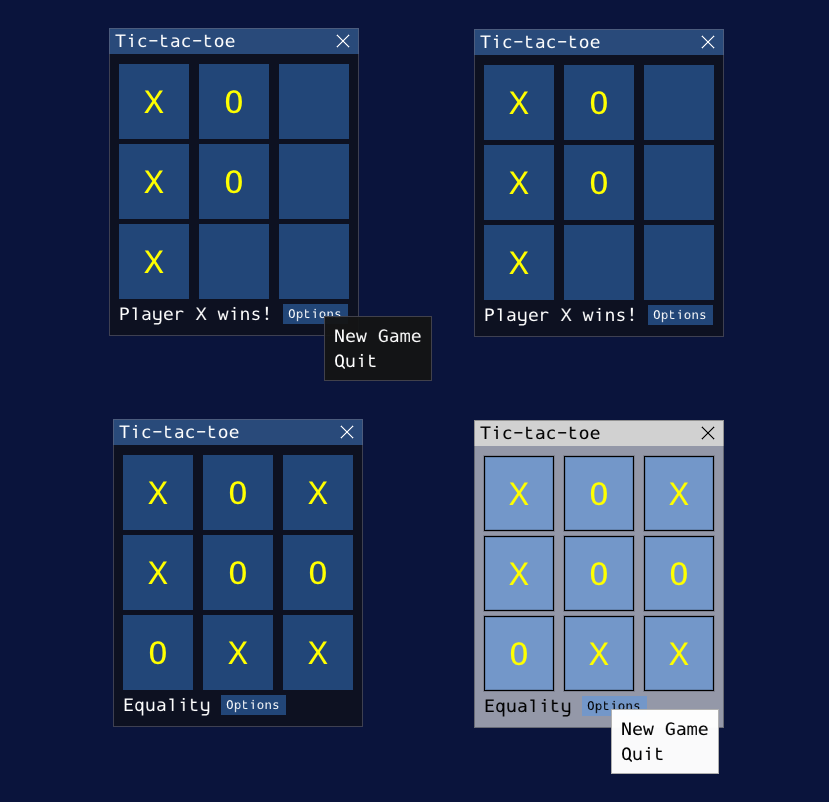

# Tic-tac-toe-with-ImGui

A modern and simple C++ game providing a simple UI using ImGui.



## Table of Contents
- [Description](#description)
- [Features](#features)
- [License](#license)
- [Installation](#installation)

## Description
This is a simple Tic-Tac-Toe game written in C++ using ImGui.
The code with render loop is not included!

## Features
- Check for winner: displays text with the winning symbol
- Check for equality (draw): displays a message if no one wins
- New game option: popup window with options to start a new game or quit

## License
Apache License 2.0

## Installation
1. Clone the repository:
```bash
git clone https://github.com/ERENGG7/Tic-tac-toe-with-ImGui.git